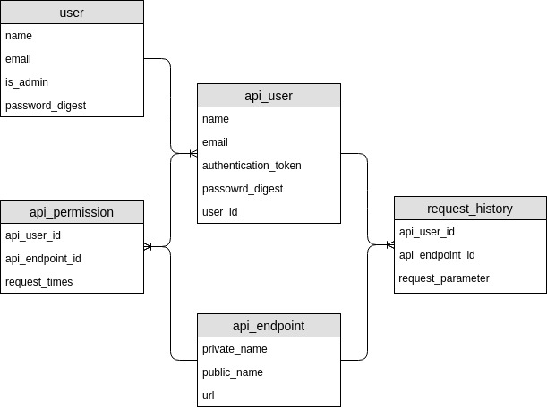

## Build an API demo 

### GDS REST API 使用手册

> 使用ROR来实现，OAuth/admin portal(业务人员可操作页面)/api call statistic




### step 1: get your login(email/password) from admin

### step 2: generate access token

HTTP POST http://10.100.25.23:3000/api/v1/sessions

header
- content-type: application/x-www-form-urlencoded

body
- user[email]=xxx@cscs.com&user[password]=whatever

```
{
"session": {
	"id": 1,
	"name": "mark",
	"token": "95LzmhGr1Mg0dUep5wug5KIaJXG8wi2WHYh+LifHlj2Ie3PSr8lowPTpQ7hkC718219rZ9U/EA3aRTOaRGOBPA=="
	}
}
```

### step 3: call avaliable API endpoint for your account

HTTP GET http://10.100.25.23:3000/api/v1/company?company_name=中证信用增进股份有限公司

header
- content-type: application/x-www-form-urlencoded
- authorization: Token token=`<token_string>`,email=xxx@cscs.com


### TBD (split page)

HTTP GET http://10.100.25.23:3000/api/v1/user/1/microposts?page=3

HTTP GET http://10.100.25.23:3000/api/v1/user/1/microposts?per_page=4 (each page size is 4)
```
{
	"paginate_meta": {
		"current_page": 3,
		"next_page": 4,
		"prev_page": 2,
		"total_pages": 4,
		"total_count": 100
		},
	"microposts": [
		{
			"id": 51,
			"title": "title-50",
			"content": "content-50"
		},
		{
			"id": 52,
			"title": "title-51",
			"content": "content-51"
		},
		{
			"id": 53,
			"title": "title-52",
			"content": "content-52"
		},

}
```  
